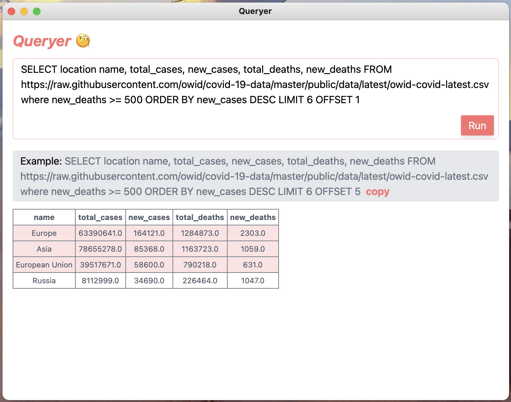

# Result

# Details
- use `tailwindcss`
- use `vite` `vue-next(ts)`
- use `clipboard.js`
- to enable copy/paste on macos, menu is needed(see src-tauri/main.rs)

# Attention
Only test on macos bigsur...
